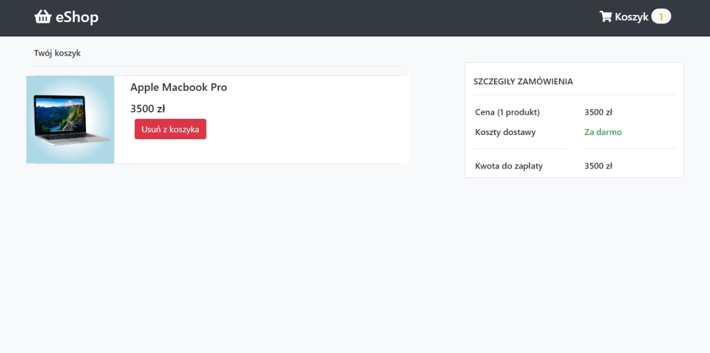

# Projekt Sklepu Internetowego

## Założenia projektu
Głównym celem projektu jest stworzenie prostego sklepu internetowego.

### Nazwa projektu
Sklep nazywać się będzie: **eShop**.

### Dostępne opcje
* Dodanie produktu do koszyka
* Usuwanie produktów z koszyka
* Zliczanie wszystkich cen w koszyku

### Efekt końcowy



## Użyte narzędzia
### IDE
* Visual Studio Code
* PhpStorm 2022

### Inne
* XAMP

### Języki
* HTML
* CSS
* JavaScript
* PHP
* MySQL


### Framework
* Bootstrap
* Font Awesome

---
## Dokumentacja kodu
### Kafelki


Każdy kafelek to komponent który pochodzi z php. Dane kafelka uzupełniamy z bazy danych. W `index.php` pozostawiamy funkcje któa pobiera wiersze z bazy danych i wysyła je argumentami do funkcji `component` w pliku `component.php`. 

``` php
<?php
    $result = $database->getData();
    while ($row = mysqli_fetch_assoc($result)){
        component($row['product_name'], $row['product_price'], $row['product_before_price'], $row['product_image'], $row['id'], $row['product_evaluation']);
    }
?>
```

## Baza danych

#### Zdjęcie
Aby wyświetlić zdjęcie w kafelku należy umieścić je w folderze `image`. Następnie w kolumnie `product_image` podać nazwę zdjęcia.

#### Przecena
Podanie wartości w kolumnie `product_before_price` spowoduje wyświetlenie ceny jako przecena (przekreślonej). Jeżeli nie podano ceny to zostanie wyświetlona tylko cena właściwa z kolumny `product_price`.

### Automatyczne tworzenie bazy danych
W pliku `CreateDb.php` odbywa się automatyczne tworzenie bazy danych. Ułatwia to tworzenie strony na serwerze.